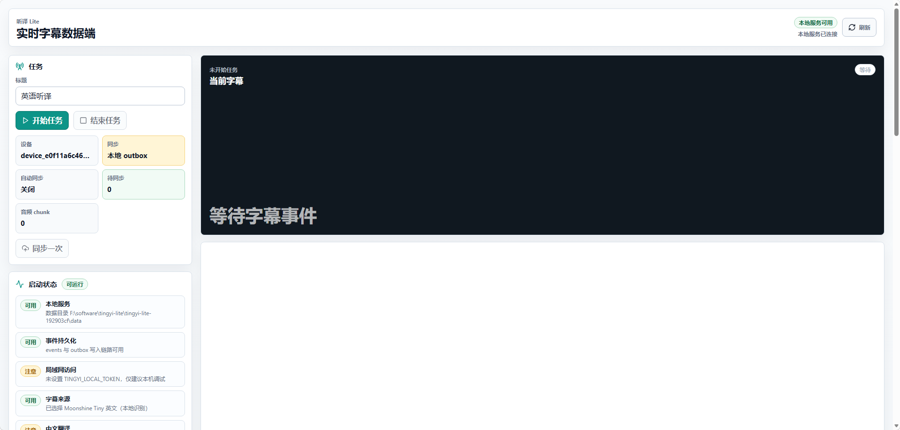
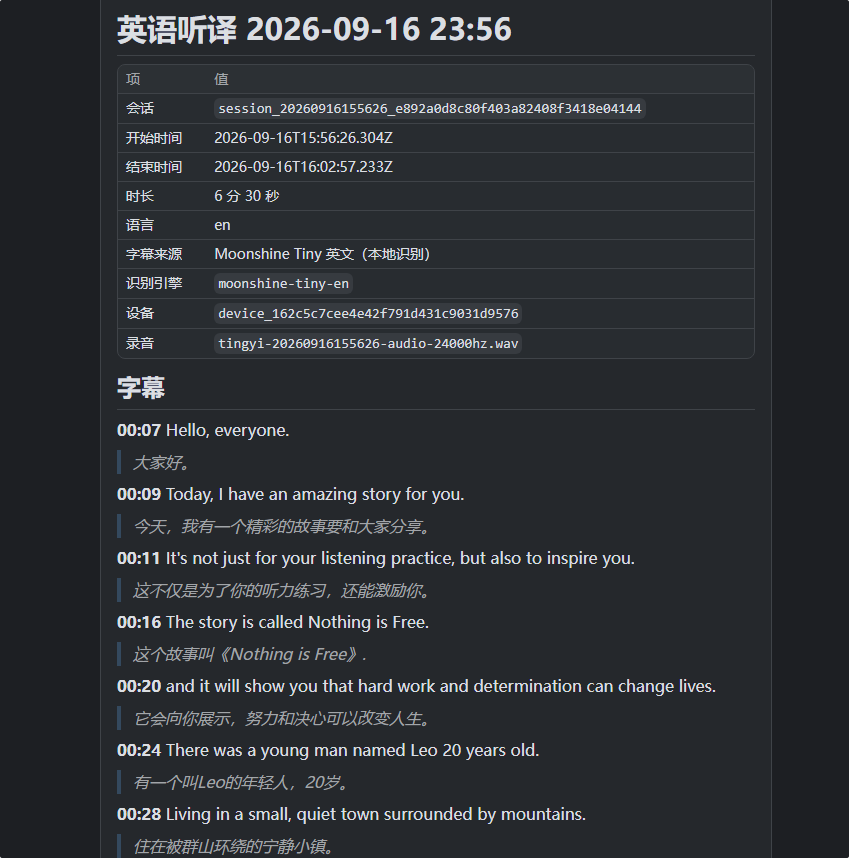
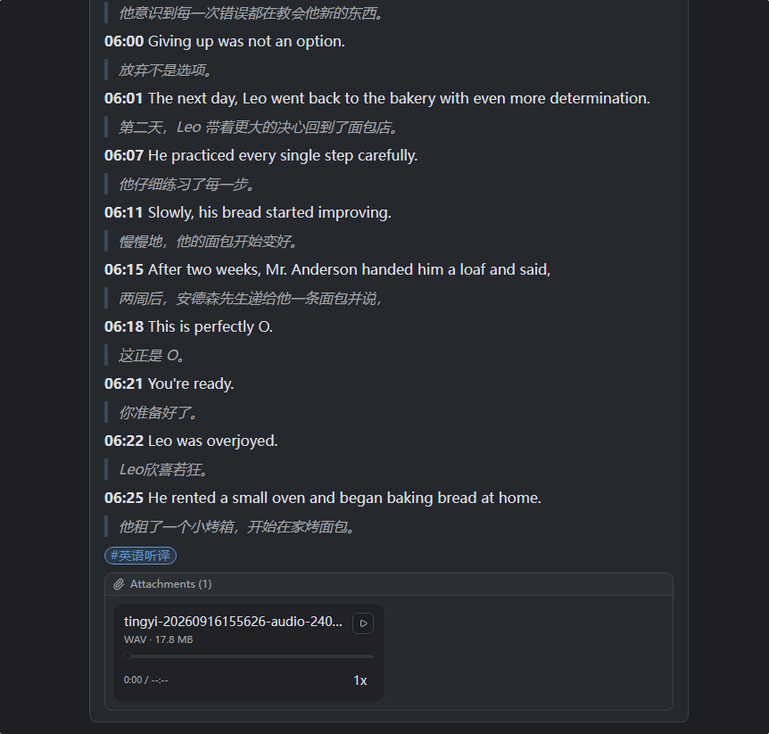

# 听译 Lite

Windows 本机的实时听译工具：采集这台机器上正在播放的声音，离线转写成字幕，并把录音与字幕留在本地。

不需要联网、不需要 GPU，也不需要安装 Python、CUDA 或额外的运行时——便携包里已经带齐全部依赖与离线模型。



## 功能

**实时字幕**

- 采集系统播放声（WASAPI render loopback）并本地离线识别，边说边出字
- 也可切换 Windows Live Captions 作为字幕来源；另有只录音、不做识别的纯录音模式
- 浅色 / 深色主题，跟随系统，也可在页面右上角手动切换

**离线模型**

- 英文：Moonshine 流式模型，低延迟，适合会议、课程与视频
- 中文：FunASR Paraformer 2-pass，流式加离线二遍，内置 VAD 断句、标点恢复与数字规范化
- 模型常驻内存；语言在设置里显式选择，运行中不会自动换模型

**可选中文翻译**

- 字幕落盘后可调用你自己配置的 OpenAI 兼容模型翻译成中文，默认关闭

**录音与回放**

- 系统声音按 30 秒 WAV 分块持久化，可在页面里点字幕定位播放，并跨分块自动续播
- 手机可通过局域网页面录音（需要受信任的 HTTPS 页面）

**数据留在本地**

- 字幕、翻译、笔记、录音与同步状态以追加式 JSONL 保存在包内 `data/` 目录
- 可选出站：把学习事件同步到你自己的服务端；或把一场已结束的会话**手动**上报到自建 Memos —— 正文是带时间戳的字幕，附件是合并成整场的录音





**界面**

- Web 实时页：字幕舞台、最近上下文、同步与启动状态
- 叠加层页面与 Windows 原生置顶叠层窗，可放在屏幕角落作为字幕条
- 会话可导出为带校验信息的学习包

## 运行要求

Windows x64。采集链路基于 WASAPI 与 UI Automation，没有 Linux / macOS 版本。

## 快速开始

**便携包（推荐）**

从 [Releases](../../releases) 下载 `tingyi-lite-*-win-x64.zip`，解压后双击 `start.cmd`，浏览器会打开 `http://127.0.0.1:8787/`。

**从源码运行**

源码仓库不含离线模型（两个 runtime 合计约 850 MB，作为 release 资产分发）：

```powershell
npm ci
pwsh -File scripts/fetch-local-asr-runtimes.ps1   # 下载两个离线 runtime，按 SHA-256 校验后解压到 runtime/
npm run server
```

脚本默认取最新 release，也可指定版本（`-Tag v0.1.1`）或加 `-Force` 重装。不想用脚本的话，直接到 [Releases](../../releases) 下载两个 zip 解压到仓库 `runtime/` 下也行。

## Release 资产

| 资产 | 用途 |
| --- | --- |
| `tingyi-lite-<version>-win-x64.zip` | 免安装便携包，含 Node.js、.NET 运行时与两个离线模型 |
| `moonshine-cpp.zip` | 英文离线 runtime，源码运行时需要 |
| `funasr-paraformer-zh-2pass.zip` | 中文离线 runtime，源码运行时需要 |

均为普通 zip，Windows 自带解压即可，不需要额外安装压缩工具。

## 许可证

[MIT](LICENSE)。随包分发的第三方组件许可与来源见 `third_party/`，以及各 runtime 目录内的 `LICENSE*` 与 `THIRD-PARTY-NOTICES.md`。
