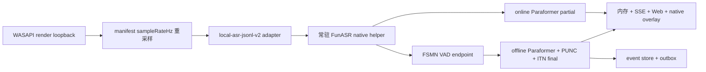

# 中文离线 ASR 选型与落地报告

## 结论

当前代码已把中文 runtime 实现为 `funasr-paraformer-zh-2pass`：FunASR C++ ONNX runtime
在一个进程内常驻加载在线 Paraformer、离线 Paraformer、FSMN VAD、CT-Transformer
标点和 FST ITN。在线模型持续输出 partial，FSMN VAD 结句时由离线模型输出 final；
会话结束通过统一 `drain` 排空尾句。运行时不需要 Python、pip、PyTorch、ModelScope
SDK、CUDA、端口或外部服务，CPU 版可随 Windows x64 便携包发布。

部署和流式架构已达到“中文、离线、流式、模型常驻、开箱即用”，但真人会议识别质量
尚未通过最终门禁。`data/0813/data` 只有旧 sherpa 结果而没有原音频，不能据此对当前
FunASR 做同源 A/B。“体积小”也只能相对完整 Python/PyTorch 形态成立：模型闭集为
728.90 MiB，完整中文 runtime 为 741.48 MiB。这是 online partial + offline final +
标点 + ITN 的质量/体积取舍，不应把旧 600 MiB 便携目录当成本方案成包大小。

服务仍只有 `local-asr` 与 `system-captions`。Moonshine 保持默认英文引擎，中文通过
`localAsrEngineId=funasr-paraformer-zh-2pass` 显式选择。没有跨模型 fallback、自动
切系统字幕或服务端 `engineId` 条件分支。旧 sherpa 中文 helper 和准备脚本已删除。

## 统一评测方法

- 输入统一为 16 kHz mono PCM16，按 600 ms 块连续送入同一个已加载实例。
- 固定标准句覆盖会议日期、设备编号/温度、专业术语；另测短句、连续讲话、停顿、
  立即结束、安静、背景音乐、弱人声和同句重复。
- 记录初始化、音频时间上的首个 partial、单块计算延迟、final 计算、RTF、峰值工作集、
  峰值线程、模型重复加载次数、CER、partial/final 数量、重复、漏尾与顺序。
- CER 去标点后计算；数字是否保留为阿拉伯数字另作业务命中，不用归一化掩盖错误。
- 绝对耗时用于复现实验，通用结论以 RTF、延迟分布、资源占用和相同测试集表达。
- 原型报告位于 Git 忽略的 `.runs/asr-selection/results/`；统一脚本为
  `scripts/asr-candidate-benchmark.ts`。测试媒体、缓存和 `.runs` 不进入 Git 或发布包。

## 候选比较与淘汰

| 候选 | 原型或阻塞证据 | 流式 / partial / 常驻 | 统一实测摘要 | 发布与许可证 | 结论 |
| --- | --- | --- | --- | --- | --- |
| FunASR Paraformer 2-pass native ONNX | `funasr-paraformer-two-pass-native.json`，正式 helper 通过连续 VAD 双遍测试 | 是 / 是 / 是 | 初始化 3.876 s；峰值 874.30 MiB、19 线程；RTF 0.0489..0.0498；首 partial 音频 0.6..1.2 s；final 80..115 ms；0 次加载重复 | FunASR 代码 MIT；具体模型卡均标 Apache-2.0；上游 `MODEL_LICENSE` 一并保留 | **当前优先候选；真人会议待验收** |
| FunASR contextual Paraformer offline final + 原 online partial | `funasr-contextual-control.json`、`funasr-contextual-technical-*.json`；helper 启动时编译并复用 hotword embedding | partial 来自原 online / 是 / 是 | 标准三句输出和 CER 与普通 offline final 完全相同；术语 fixture 在 control/目标热词下也完全相同；初始化 4.233..4.589 s，峰值 1560.05..1564.07 MiB，RTF 0.0531..0.0595 | contextual 模型卡 Apache-2.0；offline 模型目录 863.33 MiB | 淘汰：实测零质量增益，模型约增 636 MiB、峰值内存约增 686 MiB |
| Fun-ASR-Nano PyTorch/vLLM 或 GGUF | 官方 runtime 文档与可运行 GGUF 路径核对 | 否：整段/VAD 或固定滑窗重解码 / 非真正增量 / 可常驻 | LLM final 质量值得单独离线对照，但官方 CPU/edge 路径仍按完整 segment 解码；PyTorch/vLLM 主路径偏 GPU 服务 | 可离线，但 Qwen3-0.6B 解码与发布体积不符合 Lite 基础方案 | 淘汰主引擎：无原生增量 partial；仅保留未来 final 质量对照价值 |
| FunASR 在线 + 离线 2-pass Python/PyTorch | `funasr-paraformer-two-pass-python.json`，复用参考项目方向 | 是 / 是 / 是 | 初始化 8.786 s；峰值 2932.95 MiB、64 线程；RTF 0.1281..0.1753；模型约 1.8 GiB，另需 Python/PyTorch | 模型卡 Apache-2.0，但运行时依赖和包体不适合 Lite | 淘汰部署形态；证明模型方向可行 |
| sherpa-onnx Paraformer Streaming INT8 + Silero VAD | `sherpa-paraformer-vad-*.json` 和原生集成测试 | 是 / 是 / 是 | 初始化 0.778 s；峰值 298.39 MiB、6 线程；RTF 0.0530..0.0557；runtime 246.32 MiB | Apache-2.0 + Silero MIT，可分发 | 速度/体积优秀，但在线结果作为 final 的数字文本质量弱于带 ITN 的 FunASR 2-pass |
| sherpa-onnx Zipformer small CTC INT8 | `sherpa-zipformer-ctc-native-v2.json` | 是 / 是 / 是 | 初始化 0.643 s；峰值 102.23 MiB；RTF 0.0159..0.0167；模型 25.78 MiB | 模型归档无法取得明确可再分发许可证 | 淘汰许可证风险 |
| sherpa-onnx Zipformer 14M | native streaming 原型 | 是 / 是 / 是 | runtime 77.57 MiB；标准句有明显重复字和识别错误 | runtime 可分发，模型质量未过门槛 | 淘汰质量 |
| x-ASR Zipformer Transducer INT8 | `sherpa-x-asr-160ms-native-v2.json` | 是 / 是 / 是 | 初始化 2.444 s；峰值 260.79 MiB；RTF 0.0846..0.0857；漏尾词“数据” | 模型许可仍需单独确认 | 淘汰质量/延迟无优势 |
| WeNet U2/U2++ | `wenet-u2pp-offline.txt`，可取得模型只暴露 offline recognizer | 当前模型否 / 否 / 可常驻 | 133299736-byte ONNX；批量 RTF 0.019；“摄氏度”误作“摄施度” | 框架能力不能替代该发布模型的实际能力 | 淘汰：无法以本次模型实现真正 streaming partial |
| Vosk small-cn 0.22 | `vosk-small-cn-0.22.json` | 是 / 是 / 是 | 初始化 0.598 s；峰值 190.91 MiB；RTF 0.1524..0.1745；数字和专业词错误明显 | Apache-2.0，可分发 | 淘汰质量与 RTF |
| whisper.cpp tiny/base | native CLI/stream 原型 | 滑窗重解码 / 预览 / 常驻 | tiny/base 模型 74.09/141.10 MiB，RTF 约 0.106/0.21；中文错误明显 | MIT runtime，模型来源可核对 | 淘汰：不是真正增量 decoder，中文质量不足 |
| SenseVoiceSmall q8 GGUF | 原 Lite smoke 和三句日志 | 否 / 否 / 原实现每段重载 | 单段 final 尚可，但没有低延迟 partial，旧 15 秒分段造成几十秒字幕块 | 可携带，但实现不满足流式产品定义 | 淘汰并删除，不再缩短固定分段 |

FunASR 继续作为第一优先不是因为名气本身，而是当前唯一同时满足 online partial、
FSMN VAD、offline final、数字 ITN、原生自包含和明确许可证材料的已运行候选。sherpa
方案更小、更快，但真实会议快照已经暴露其技术词质量问题；Zipformer CTC 即使跑分
最好，也因模型许可证证据不足不能发布。FunASR 只有在同源真人会议音频上胜出后，
才能从“当前优先候选”升级为最终质量结论。

## 2026-08-13 真人会议快照复核

`data/0813` 是外层快照，实际 Lite 数据根是 `data/0813/data`。只读 `data:doctor`
检查通过其结构一致性：190 条事件、1 个会话、190 个 outbox item，但音频 chunk 和
可用音频文件均为 0。会话使用的是旧 `sherpa-onnx-paraformer-zh`，不是当前 FunASR；
它留下 183 条 final。字幕时长 min 394 ms、p50 3146 ms、p95 7274 ms、max 13750 ms，
因此这次用户反馈的主因不是固定几十秒分段，而是 PLC、PCM、POC、RPC、Excel、
CheckInfo 等会议术语被错误识别，以及弱声、多人和连续讲话下的内容质量。

来源在约 19 分 37 秒后以 `0x88890004` 失败。Windows SDK 将它定义为
`AUDCLNT_E_DEVICE_INVALIDATED`，说明默认音频设备在会话中失效；服务不得因此切换模型
或系统字幕。新录音链路会在这类异常清理期间 flush 剩余 WAV，且应用关闭会等待该
异步清理和事件落盘。旧快照没有 `audio.chunk.saved`，所以无法回放，也无法把同一段
会议直接重跑 FunASR/SenseVoice；任何基于该快照宣称 FunASR 真人会议 CER 已通过的
结论都不成立。下一轮必须用新版 Lite 录下同一类技术会议，保留原 WAV 后再做同源 A/B。

## FunASR 实测

### 标准句（固定合成 fixture）

| case | 输出摘要 | 首 partial 音频时间 | final 计算 | RTF | raw CER |
| --- | --- | ---: | ---: | ---: | ---: |
| 会议长句 | `明天3:30p.m.`、`第2季度销售数据` | 1200 ms | 115 ms | 0.0498 | 0.1875 |
| 设备号/温度 | `20260808`、`23.5°C` | 600 ms | 80 ms | 0.0489 | 0.1304 |
| 专业术语 | 完整命中实时字幕、专业术语、系统配置 | 1200 ms | 110 ms | 0.0494 | 0 |

这些结果用于验证协议、性能、数字 ITN 和回归稳定性，不替代真人会议质量验收。
三条样本共用一个进程和一套模型，`modelReloads=0`；每句 11..14 个 partial、1 个
final、0 个重复 partial。首个 partial 的单块计算约 22.4..23.4 ms。初始化 3876 ms，
峰值工作集 874.30 MiB，峰值线程 19，推理参数为 4 个 ONNX intra-op 线程。

关闭 ITN 时 RTF 仍为 0.0492..0.0496，会议句 CER 0.0313、数字句 CER 0.5652、术语句
CER 0。启用 ITN 后数字句明显改善，但会把“明天下午三点半/第二季度”格式化为
`明天3:30p.m./第2季度`。默认启用 ITN，因为产品更重视设备号、日期和温度；不在
服务端增加文本后处理或静默切换。

### 分段、重复与尾句

23.395 秒连续中文夹短暂停顿得到 3 个有序 final，时间约为 0.60..8.09 s、
9.60..14.79 s、16.20..23.38 s。相同样本连续播放两遍得到 6 个不同 utteranceId，
不存在误去重、重叠或乱序；37 个 partial 都被对应 final 收口。分段由 FSMN VAD
产生，不由 30 秒录音文件边界或服务端 RMS 阈值决定。

会话结束顺序为停止新采集、提交剩余 PCM、逐 source 发送 `drain`、等待 final/clear
和 result ack、再发送 `shutdown`。drain 或 final 持久化失败不会伪造 session ended。

helper 曾通过真实播放器/WASAPI 完整 445 秒 `test.mp4`：84 个有序 final，分段时长
min 810 ms、p50 2.92 s、p95 9.66 s、max 20.01 s，未出现超过 manifest
21.9 秒验收上限的大段，也没有零时长、重复、乱序、迟到 final 或漏尾。随后用户单一
连续音源在 428 秒暴露了交叉边界：`modelEnd=412235` 仍属于上一句，
`modelStart=412515` 和 `partialStart=412575` 已属于下一句。旧 helper 会把下一句 start
用于上一句 final 并快速失败。FunASR 上游
在同一推理块同时遇到“上一句结束/下一句开始”时会让结果中的 `start` 指向下一句，
而 `end` 仍属于上一句；online 剩余长度为 0 时还会推送 0 样本 final frame。helper
因此按实际 16 kHz PCM 样本数维护唯一模型时钟，并跨推理块保存当前句最早的有效 VAD
start；final 优先使用该边界，且严格要求 `lastFinalEnd <= start < end`。FunASR 在同一
结果中返回“上一句 end + 下一句 start”时，helper 先提交上一句 final，再建立下一句
partial；上一句缺少独立 start 时使用已经持久化的 `lastFinalEnd`，仍要求
`lastFinalEnd < end`，不会生成倒退或零长度区间。它不会伪造
1 ms 时间段，也不会丢弃 non-empty offline final。带每块 2 ms 人工请求时钟漂移的
双遍测试仍得到 6 个单调 final。修复后的 helper SHA-256
`3eca85fe72ef418ec165fe1bf4ebe0ad966f32668a522b957ff2ee255451f476`；把失败会话保存的
408.6 秒真实 WASAPI 音频连续重复三遍，单实例无声处理 1225.8 秒，得到 1919 个
partial 和 76 个有序 final，三次经过原故障边界均未失败。新便携包仍需用户在目标机
完成真实扬声器连续 20 分钟复验。

186 秒 `test.mp3` 真实播放器/WASAPI 得到 38 个 final：min 1.37 s、p50 3.22 s、
p95 5.43 s、max 5.62 s；同样通过非零、单调、去重、尾句 drain 和结束后指纹稳定
检查。当前 `test.mp3`/`test.mp4` 内容均为英文，因此只作为真实媒体、VAD 和长流链路
证据；中文质量结论来自固定三句和连续中文 fixture，不能用这两份英文媒体外推中文 CER。

## 当前门禁状态（2026-08-14）

| 门禁 | 结果 |
| --- | --- |
| TypeScript typecheck + Web build | 通过；Vite production build 成功 |
| 全量自动化测试 | 通过；33 个 test file、272 个 test |
| Server bundle | 通过；Node 22 ESM bundle 成功 |
| native overlay / system captions / WASAPI | 三个项目均以 warning-as-error 构建，0 warning / 0 error |
| Moonshine direct / server / loopback | 通过；默认英文 engine 保持不变 |
| FunASR 中文 direct / WASAPI loopback | 通过；三条固定标准句均有 11..14 个 partial、唯一 final，数字和术语断言通过 |
| `test.mp3` / `test.mp4` | 通过完整真实播放器/WASAPI、顺序、去重、分段上限、尾句 drain 和结束后稳定性检查 |
| runtime manifest | 通过闭集逐文件 SHA-256；Moonshine 18 文件，FunASR 45 文件 |
| `git diff --check` | 通过；只有 Git 的 LF/CRLF 提示，没有 whitespace error |
| `package:lite` | 通过；清洁 Git 来源构建 82 个文件，约 1.160 GB，精确值以交付包 manifest 为准 |
| 新包 `package:verify` / `package:smoke` | 通过；闭集/SHA-256 复核和真实包内启动 smoke 均成功 |
| 真人中文技术会议 | **尚未通过**；现有 `data/0813/data` 无原始音频，无法同源重跑当前 FunASR |

最终中文回环中三条标准句的 runtime 初始化分别为 3615、3697、3567 ms；direct 首个
partial 分别为 3655、3718、3606 ms（其中约 3.6 秒为进程初始化），每条均只有一个
final。模型在单个真实会话内常驻；统一 benchmark 的音频时间首 partial 为 0.6..1.2 秒，
不能把进程冷启动时间误算成每个分段的增量识别延迟。

## 模型与发布体积

| 组件 | 字节 | MiB |
| --- | ---: | ---: |
| CT-Transformer punctuation ONNX | 281877652 | 268.82 |
| offline Paraformer ONNX | 238380216 | 227.34 |
| online Paraformer encoder ONNX | 166350528 | 158.64 |
| online Paraformer decoder ONNX | 71867274 | 68.54 |
| 其余模型、配置和 ITN | 5820639 | 5.55 |
| 模型闭集合计 | 764306309 | 728.90 |
| 完整中文 runtime（含 DLL、许可证、helper） | 777496309 | 741.48 |

旧约 600 MiB 便携目录使用的是更小的中文 runtime，不能代表当前 2-pass 版本。新的
`package-manifest.json` 连续两次实测均为 82 个文件，分别为 1,160,290,224 和
1,160,290,234 bytes（均为 1106.54 MiB / 1.081 GiB）；self-contained host 重建存在
个位数字节波动，精确值以最终交付包 manifest 为准。包内只包含默认英文 Moonshine
runtime 和最终中文 FunASR runtime，不携带候选模型、Python、PyTorch、测试媒体、数据
或缓存。

## 架构与协议

`local-asr-jsonl-v2` 只描述通用音频流和转写状态，不含 FunASR、Moonshine 或模型专属
字段：

- helper 首行 `ready`：`protocol / engineId / language / sampleRateHz`；
- 输入 `audio`：`requestId / sourceId / sequence / startMs / endMs / rms / audioBase64`；
- 输入 `drain`：`requestId / sourceId / endMs`；
- 输入 `shutdown`：必须返回 result ack；
- 输出 `transcript`：`utteranceId / revision / state=partial|final|clear`，partial/final 带
  `text / startMs / endMs`；
- 输出 `result`：每个命令明确成功或错误。

partial 只存在内存、SSE、Web 和 native overlay；final 才构造 `CaptionSegment` 并进入
event store/outbox。中文 final 不进入中文翻译队列。final 会替换对应 partial，协议没有
v1 兼容层。

## 修改文件清单

- FunASR runtime/helper：新增 `src/native/FunAsrLocalAsrHelper/`、
  `scripts/prepare-funasr-paraformer-runtime.ps1`、
  `scripts/write-funasr-paraformer-runtime-manifest.ps1` 和原型
  `scripts/funasr-two-pass-candidate-helper.py`；删除旧
  `src/native/SherpaOnnxLocalAsrHelper/` 及两份 sherpa 准备/manifest 脚本。
- 通用 local-ASR 与录音：修改 `src/server/localAsrRuntime.ts`、`src/server/app.ts`、
  `src/server/index.ts`，新增 `src/server/pcmWavRecorder.ts`；协议与服务端均不含
  FunASR 专属路由或 fallback。
- Web 历史任务播放：修改 `src/web/App.tsx`、`src/web/api.ts`、`src/web/styles.css`，新增
  `src/web/sessionPlayback.ts`，用户主动打开历史任务后可按 final 字幕定位 WAV chunk、连续播放和当前句高亮；Lite 不提供独立质检流程。
- Lite/云边界：修改 `src/core/eventStore.ts`、`src/core/eventValidation.ts`、
  `src/core/ids.ts`、`src/core/schema.ts`、`src/cloud/learningMaterials.ts`、
  `src/cloud/syncReceiver.ts`、`src/tools/sessionExport.ts`，移除 Lite 本地复习/教材遗留接口。
- 评测、启动与打包：修改 `package.json`、`.gitignore`、
  `scripts/asr-candidate-benchmark.ts`、`scripts/chinese-asr-smoke.ps1`、
  `scripts/local-asr-loopback-smoke.ts`、`scripts/local-asr-media-smoke.ts`、
  `scripts/package-lite.ps1`、两份 portable start、verify/smoke 和便携 README。
- 测试：新增 `test/funAsrVadRuntime.test.ts`、`test/pcmWavRecorder.test.ts`、
  `test/sessionPlayback.test.ts`；修改 server、runtime、core、cloud、responsive 和 package
  测试，删除旧 `test/sherpaVadRuntime.test.ts`。
- 文档：修改 `README.md`、`docs/architecture.md` 和本报告。

## Manifest、来源与许可证

`runtime-manifest.json` schema v2 声明 engineId、language、sampleRateHz、streaming、
partial、FSMN endpoint 参数、command/args、平台、runtime/model/VAD 来源和许可证，
以及 manifest 以外 45 个文件的闭集 SHA-256。路径逃逸、链接、清单外文件、缺失文件
或 hash 不一致都会在启动前失败。

- FunASR 固定提交：<https://github.com/modelscope/FunASR/commit/79a0ed22e14ca74d728bf77d7df0ef0c463a9680>，代码 MIT。
- ONNX Runtime 1.16.1：<https://github.com/microsoft/onnxruntime/releases/tag/v1.16.1>，MIT。
- online Paraformer：<https://www.modelscope.cn/models/iic/speech_paraformer-large_asr_nat-zh-cn-16k-common-vocab8404-online-onnx/summary>。
- offline Paraformer：<https://www.modelscope.cn/models/iic/speech_paraformer-large_asr_nat-zh-cn-16k-common-vocab8404-onnx/summary>。
- FSMN VAD：<https://www.modelscope.cn/models/iic/speech_fsmn_vad_zh-cn-16k-common-onnx/summary>。
- CT-Transformer PUNC：<https://www.modelscope.cn/models/iic/punc_ct-transformer_zh-cn-common-vad_realtime-vocab272727-onnx/summary>。
- FST ITN：<https://www.modelscope.cn/models/thuduj12/fst_itn_zh/summary>。

五个具体模型卡均声明 Apache-2.0；同时随包保留上游 FunASR `MODEL_LICENSE` 并在
notices 中明确其额外归属/行为条款，不能只用“FunASR 是 MIT”概括模型权重风险。
runtime 还保留 ONNX Runtime、glog、yaml-cpp、gflags、nlohmann-json、OpenFst、Kaldi
和 kaldi-native-fbank 的许可证文本。正式对外发布前仍建议由发行方做一次法务复核。

contextual 原型使用官方
<https://www.modelscope.cn/models/iic/speech_paraformer-large-contextual_asr_nat-zh-cn-16k-common-vocab8404-onnx/summary>，
模型卡为 Apache-2.0。其 `model_quant.onnx`、`model_eb.onnx` 和 `seg_dict` 均按官方
SHA-256 下载验证；原型只保存在 Git 忽略的 `.runs`，不会进入最终便携包。

准备脚本只使用固定官方 URL、源码压缩包 SHA-256 和逐模型文件 SHA-256，不需要
Python/ModelScope SDK。Windows 原生构建固定 CPU、FFmpeg OFF、CUDA OFF、FST ON；
官方源码在 FST OFF 时仍由 Kaldi 路径包含 `fst/types.h`，因此当前提交不能把 FST
关闭构建当成有效 Windows 方案。上游第三方编译告警与 Lite 自有 helper 的
`/W4 /WX` 0-warning 门禁分开记录。

## 残余限制

- 当前只交付 Windows x64 CPU runtime；其他平台需独立 native 构建和 manifest。
- 741.48 MiB 中文 runtime 不属于极小模型，主要代价是 2-pass 与 269 MiB 标点模型。
- ITN 的时间和序数风格不完全符合自然中文展示，当前不做模型外启发式修正。
- FunASR 未提供稳定可用的逐 token 时间戳；当前 final 时间轴使用 VAD 句界并保证单调、
  非零、无重复和不漏尾，不能把起止点视为逐字对齐。
- 固定产品句不能替代公开大规模真人、多说话人和噪声数据集 CER；仍需扩展统计评测。
- `data/0813/data` 没有任何原始音频，只能证明旧 sherpa 结果不合格，不能用于当前
  FunASR、SenseVoice 或其他候选的同源重跑；真人技术会议质量仍是未通过门禁。
- 普通 Paraformer offline 模型不含 contextual `model_eb.onnx/seg_dict`，不能把空
  embedding 当成热词能力；contextual 模型原型未产生质量收益，因此不随包发布。
- `test.mp3/test.mp4` 只在仓库外用于真实播放器/WASAPI 验收，不进入源码或发布包。
- 不提供 GPU 自动选择。未来 GPU 版必须使用独立 engineId/manifest 显式选择，不能
  静默替换 CPU 引擎。
